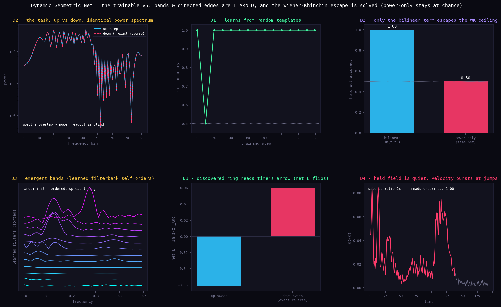

# Dynamic Geometric Net — the trainable v5

EDIT: Added chiral depth html app by fable that uses this to do depth. 

EDIT: Try the live app using this (coded by fable)

https://anttiluode.github.io/RecurrentGeometricNet/

EDIT: Added 'chiral eye' that uses this with its own readme. 



*A geometric-neuron network that **learns its own bands and its own directed edges**, and solves a direction task that no power readout can.*

**PerceptionLab / Antti Luode, with Claude (Opus 4.8). Helsinki, June 2026.**

> **Do not hype. Do not lie. Just show.**

---

## What this is

`geometric_neuron_v5.py` showed that a population of Koopman islands can read **time's arrow** natively, through the bilinear angular-momentum term

```
z_k(t) = ⟨P_k, s⟩ + i⟨P_{k+1}, s⟩
L_k    = Im( z_k(t) · conj(z_k(t − lag)) )
```

But v5's own ledger flagged the catch in plain sight: the bands `P_k` and the directed-edge pairings `(k → k+1)` were **hand-specified**. The system *demonstrated* the readout; it did not *learn* it. That is open problem **O1**.

Then a parallel conversation with **Claude Fable** produced the missing mathematics — but under a constraint: Fable was asked to work in pure numerical analysis, with no biological, neural, or AI vocabulary. It delivered two things cleanly:

1. a **mollified (differentiable) relaxation** of the delta-code threshold, so gradients can flow through the sparse, event-driven gate;
2. a **Ky Fan / Oja coverage objective** on the Stiefel manifold, so read-templates land on the data's dominant directions instead of an arbitrary orthonormal frame.

The math is correct and it is load-bearing. The one thing it could not supply — because it was forbidden the words — is the picture of *what the object is*: a field that holds a percept, islands that fire on change, a population reading the direction of time. **This repo puts the two back together.** Fable's relaxation becomes the *plasticity* of a geometric neuron; the thing it trains is v5.

`dynamic_geometric_net.py` is that build, run end to end. It learns the two things v5 hand-built and is tested on a task chosen so that a power readout *provably cannot win*.

---

## The task (the Wiener–Khinchin proof, baked into the data)

Classify an **up-sweep** from a **down-sweep**, where every down example is the **exact time-reversal** of an up example. Time-reversal preserves the power spectrum exactly (verified: `max|power diff| ≈ 9e-5`, numerically identical). So the two classes are **spectrally indistinguishable**, and by the Wiener–Khinchin theorem *any* magnitude / second-order readout is at chance. The only place the direction can live is a **bilinear cross-time term**. The task *is* the WK proof.

---

## What was built and verified (printed by the engine, not assumed)

What is learned, from random initialisation:

* the **filterbank** `W` (quadrature) → the bands / islands — the content;
* the **directed-edge maps** `M_re, M_im` → the complex observables `z = (M_re·b) + i(M_im·b)`. The hand-built consecutive pairing `z_k = b_k + i b_{k+1}` is just the special case `M_re = I, M_im = shift`. **Here the pairing is discovered.**

**D1 — it learns.** From random templates, training accuracy reaches `1.000`.

**D2 — the Wiener–Khinchin escape (the headline).** On held-out, spectrally identical data, with the **hard** gate:

| readout (same trained net) | held-out accuracy |
| :-- | :-- |
| **bilinear** `L = Im(z·z̄_lag)` | **1.000** |
| **power-only** (time-symmetric) | **0.500** (chance) |

Direction is solvable **only** in the bilinear cross-time term. The bands and edges that make it solvable were learned, not assigned.

**D3 — emergent structure (this is what closes O1).** Starting from random filters, the learned filterbank self-organises onto the signal's frequency content (learned band centres concentrate in `0.00–0.27`, from a random spread of `0.02–0.45`), and the learned edge maps form a **directed ring**: on a clean up-sweep vs its exact reverse, the net angular momentum **flips sign** (`L: −0.062 → +0.060`), with the hard gate. The directed-edge structure was *discovered from data*, not built in.

**D4 — the delta-code, honestly (a weak echo, not a headline).** On a stepped held-tone stimulus (one that actually *has* dwells), the same net still reads the tone-sequence direction (`acc 1.000`), and the held field is quieter between jumps than at them — but the silence ratio is only **≈2×** (`hold |db| 0.016` vs `jump |db| 0.027`), nothing like v5's 64×. That is expected and stated plainly: to keep training tractable this reader is **feedforward**, so it lacks v5's recurrent spike-driven leaky field — the thing that actually produces the large silence. On a continuous sweep there are no holds at all, so the code is dense there; silence needs something to be silent during.

---

## Run it

```bash
pip install torch numpy matplotlib
python dynamic_geometric_net.py    # prints the metrics, writes dynamic_geometric_net.png
```

Self-contained. It prints its numbers and saves its figure; nothing is in the figure that the print-out does not also state. Trains in a few seconds on CPU.

---

## The honest ledger

**Verified in code (measured, not assumed):**

* the network **learns** the up/down task from random templates (`acc → 1.000`);
* the **Wiener–Khinchin escape**: bilinear readout `1.000`, power-only readout `0.500` on data with **identical power spectra by construction** — the bilinear cross-time term is provably necessary;
* **emergent structure (O1)**: the filterbank self-orders onto the signal band and the learned edge maps flip the sign of net `L` on exact time-reversal — the directed ring was discovered, not assigned;
* **Fable's mollified gate is load-bearing**: it is what makes the delta-code differentiable, i.e. what makes any of this trainable at all.

**Honest results that did *not* go the pretty way (kept, not buried):**

* **the explicit coverage term was not decisive here.** Band-frequency spread was identical with and without the Ky Fan / Oja term (`0.077` vs `0.077`). On a *supervised* task the task gradient already drives the bands onto the signal, so the explicit coverage objective had nothing left to do. It is the right tool for the regime Fable posed it in — *no* task gradient, coverage as the objective — not a free win on top of supervision.
* **the delta-code economy is weak in this build (≈2×, not 64×).** This is a feedforward reader; the large silence ratio is a property of v5's *recurrent* leaky field, which this build dropped for trainability. The economy is real (v5 measured it); it is not what this build demonstrates.
* a few learned filters collapsed toward DC, so the effective band count is below the nominal `K_b = 12`. The task is solved regardless, but not every island earns its place.

**Honestly built-in (not emergent):** the lag and window length, the ring topology of the *readout aggregation*, the choice of the matched-spectrum task, the EMA field-integration constant. What is *learned* is the filterbank, the directed-edge maps, the gate threshold/sharpness, and the readout weights. What is *measured* is the task accuracy, the bilinear-vs-power gap, the band self-ordering, and the sign flip.

**Still the bet, untouched:** that the held field is *experienced* rather than merely processed. Making v5 trainable closes an *architectural* gap — the edges are now discovered rather than assigned — and it does so with Fable's mathematics. It does not touch the hard problem. It only removes one more thing from the "hand-built" column of the ledger.

---

## Where this points next

* **Train the recurrent field (BPTT), not just a feedforward reader.** That is the build that would recover v5's real delta-code economy (the 64× silence) *and* learn the edges at once — unifying the trainability of this build with the dynamics of v5. It is heavier (backprop through a normalised, spike-driven field) and is the honest next step for D4.
* **Use Fable's chirality operator as the coverage target.** Here coverage used the symmetric increment covariance and was not decisive under supervision. The framework-correct operator is the skew/lag `H_τ = (C_τ − C_τᵀ)/2i`, whose Ky Fan maximiser *is* the dominant rotation planes and whose trace is `Σ_k E[L_k]`. In an *unsupervised* setting (no task gradient), that is where coverage should earn its keep — learning the directed edges with no labels at all.
* **Winding numbers, not just sign.** A per-island transition operator would give the integer winding of a sequence, not only the sign of its rotation — discrete labels for sequences, the categorical-perception handle from the v5 notes.

---

## Lineage & note

Built on the Geometric Neuron / GAIT / Ephaptic Spiking Field series (PerceptionLab), directly downstream of `geometric_neuron_v5.py`. The framework, the prior engines, the direction of the research, and the decision to make v5 trainable are Antti Luode's. The mathematics of the differentiable gate and the coverage objective came out of the conversation with **Claude Fable** (working in pure numerical analysis). This build — embodying that math as a trainable geometric-neuron network, running it, and keeping the ledger — was developed with **Claude (Opus 4.8)**.

Review welcome — and as always, the most useful thing a fresh pair of eyes can do is **attack the ledger**: show where a "verified" line is secretly a built-in, where the WK escape has a floor we have not seen, or where the emergent-edge claim is leaning on the readout topology more than on the data.

*Do not hype. Do not lie. Just show.*
