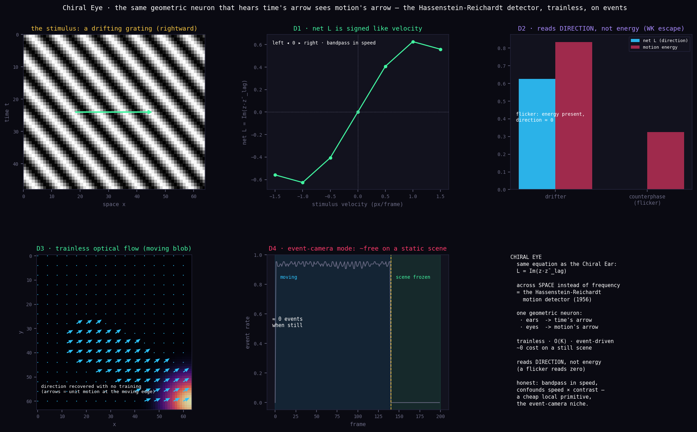

# Chiral Eye — the geometric neuron, given sight



*The same neuron that hears the direction of time sees the direction of motion. One equation, two senses — and a hardware home that fits it exactly.*

**PerceptionLab / Antti Luode, with Claude (Opus 4.8). Helsinki, June 2026.**

> **Do not hype. Do not lie. Just show.**

---

## The question this answers

*"If we deploy this as a dynamic AI, what real-world dataset or hardware do we unleash it on first?"*

The answer is hiding in the engine's own arithmetic. The chiral readout

```
L = Im( z(t) · conj(z(t−lag)) ),   z_k = signal_k + i·signal_{k+1}
  = neighbour(t)·here(t−lag) − here(t)·neighbour(t−lag)
```

is — term for term — the **Hassenstein–Reichardt elementary motion detector** (1956), the model of how a fly sees motion. The Chiral Ear runs it across **frequency** and reads the direction of a pitch sweep. Run the identical operator across **space** and it reads the direction of **motion**. The Chiral Eye is not a new model; it is the Chiral Ear's equation pointed at the world.

And it has a hardware home that fits like a key: an **event camera** (DVS) outputs brightness-*change* events — a delta-code. The geometric neuron *consumes* a delta-code. A delta-code sensor feeding a delta-code processor gives motion direction that is trainless, O(K) per event, and ~free on a static scene. That is the deployable thread the grounded ledger already named: *"trainless, O(K) neuromorphic / event-camera direction sensing."*

---

## What was built and verified (`chiral_eye.py`, run on synthetic motion)

**D1 — direction tuning.** Net `L` is signed like the stimulus velocity (left −, right +, static 0) and **bandpass in speed** — peaking at a preferred velocity, exactly like a real EMD. Stated, not hidden.

**D2 — the visual Wiener–Khinchin escape.** A drifting grating gives a large signed `L`; a **counterphase flicker** of matched spatial frequency gives **net `L` ≈ 0 despite real motion energy**. A magnitude / motion-energy readout is fooled (it sees energy, can't sign it); the bilinear cross-time term correctly reports *no net direction*. Same escape as the Ear, now in the eye.

**D3 — trainless optical flow.** A moving Gaussian blob, no weights, recovered as a motion vector field whose mean points in the true direction of travel to **< 1° angular error** (0.1°, 1.0°, 0.2° for down-right, down-left, up).

**D4 — event-camera mode.** Feed it brightness-*change* events instead of pixels: direction is still read (same sign), and the event rate — hence the compute — collapses to **~0 on a frozen scene**. The delta-code economy, in vision.

```bash
pip install numpy matplotlib
python chiral_eye.py            # prints metrics, writes chiral_eye.png
```

## Point it at the real world

```bash
pip install opencv-python numpy
python chiral_eye_webcam.py     # live; an arrow tracks motion direction, press q to quit
```

`chiral_eye_webcam.py` runs the **identical** operator on your camera (its core sign was checked; the camera loop itself was not run in the build sandbox — it's kept minimal for that reason). A natural next artifact is a browser **Chiral Eye** mirroring the live `index.html` Chiral Ear, so it runs on a phone with no install.

---

## The honest ledger

**Verified in code:**
- net `L` is signed like velocity and bandpass in speed (D1);
- the visual WK escape: counterphase flicker → net `L` ≈ 0 with energy present, drifter → large signed `L` (D2);
- trainless 2D optical-flow direction to < 1° on a moving blob (D3);
- event-mode: direction read from change-events alone, ~0 cost on a static scene (D4);
- the spatial operator is **algebraically** the Hassenstein–Reichardt EMD (derivation in the header).

**Honest limits (the real ones, not cosmetic):**
- it is an EMD, a **known** model — the novelty here is not the detector, it is that the Ear's equation *is* this detector, so one geometric primitive does both senses, trainless and event-native;
- like every EMD it is **bandpass in speed** and **confounds speed with contrast / spatial frequency** (the aperture problem). It is a cheap *local* direction primitive, **not** a full optical-flow solver. Reading global object velocity needs pooling these detectors — which is exactly what fly lobula-plate tangential cells, and Reichardt arrays, do;
- the optical-flow vector *magnitude* is small because it is averaged over a mostly-empty field; the *direction* is the result.

**Still the bet, untouched:** none of this claims the held field is *experienced*. The Chiral Eye is the cheap, true, useful half of the program — a near-free direction sense — sold on cost, not on the bet.

---

## The deployment menu (Eye first, then these)

1. **Chiral Eye → event cameras (this build).** Public event-camera datasets to validate on real data: DVS-Gesture, N-Cars, N-Caltech101, MVSEC. Hardware: a DVS/DAVIS sensor (~$300) is the native fit; a webcam differenced into events is the zero-cost stand-in (`chiral_eye_webcam.py`). Pitch: motion/looming/direction sensing for drones, wearables, always-on sensors, where the win is *milliwatts*, not accuracy leaderboards.

2. **Chiral Ear → bioacoustics.** Animal calls are full of FM sweeps whose *direction and rate* identify species — bat echolocation (down-sweeps), bird syllables, frog/insect calls. The WK escape matters here (a power spectrum loses the FM structure), and the delta-code matters (a solar field recorder that computes only when something calls). Data: Xeno-canto (birds), bat-call libraries. This is the most directly *fundable* thread (biodiversity monitoring).

3. **Chiral Ear → machine condition monitoring.** Run-up/coast-down, bearing and gear-mesh faults are spectral sweeps; a battery vibration sensor that reads the *direction* of spectral drift and only wakes on change is a clean industrial fit.

My recommendation for *first*: the **Eye on an event camera**, because it (a) proves the framework's universality claim with the same engine, (b) is the deployable thread your own ledger named, and (c) is the one case where the sensor and the processor are the *same idea* — change-events in, change-events out.

---

## Lineage & note

Built on the Geometric Neuron / GAIT / Chiral Ear series (PerceptionLab), reusing the chiral operator from `recurrent_geometric_net.py` / the Chiral Ear unchanged. The framework and direction are Antti Luode's; this build (the Eye, its figure, the event-mode demo, the ledger) was developed with **Claude (Opus 4.8)**.

The most useful thing a reviewer can do, as always, is **attack the ledger** — here especially: is the universality claim more than the EMD identity? where does the aperture problem bite a real deployment? does the event-camera economy survive sensor noise?

*Do not hype. Do not lie. Just show.*
